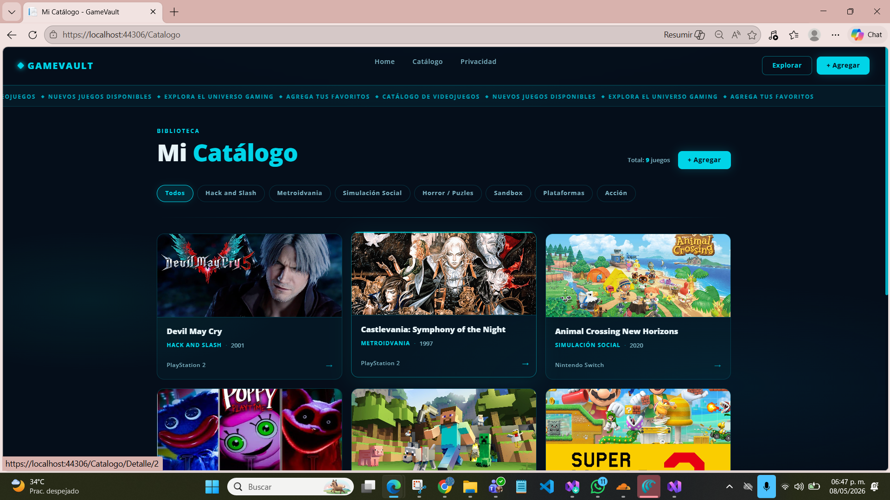
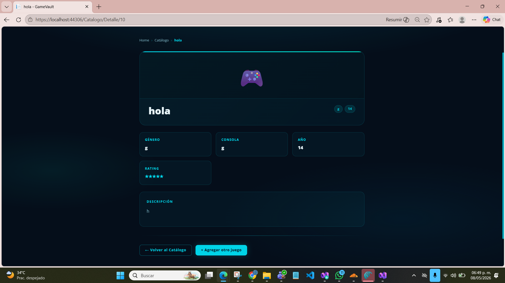
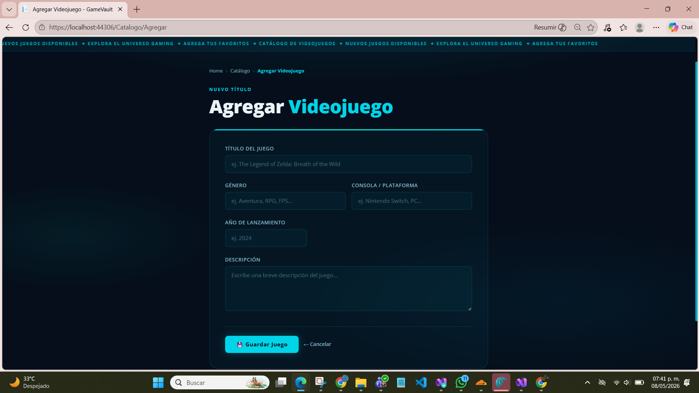

# GAMEVAULT
GameVault es una aplicación web realizada con la finalidad de gestionar y explorar una colección de videojuegos, la cuál te permite agregar títulos con su información completa y visualizarlos en un vatálogo con filtros por género.

---
 
## Capturas de pantalla
 
### Página de inicio

 
### Catálogo completo

 
### Detalle de juego

 
### Formulario de agregar

 
### Política de privacidad

 
---
 
## Tecnologías utilizadas
 
| Tecnología | Descripción |
|---|---|
| **ASP.NET Core MVC** | Framework principal para la arquitectura del proyecto |
| **C#** | Lenguaje de programación del backend |
| **Razor (.cshtml)** | Motor de plantillas para las vistas |
| **HTML5 / CSS3** | Estructura y estilos de la interfaz |
| **Bootstrap** | Librería CSS para componentes base |
| **JavaScript** | Interactividad en el cliente |
| **Open Sans** | Tipografía principal vía Google Fonts |
| **Visual Studio Community** | IDE de desarrollo |
 
---
 
## Estructura del proyecto
 
```
GameVault/
├── Controllers/
│   ├── HomeController.cs
│   └── CatalogoController.cs
├── Models/
│   ├── Item.cs
│   └── ErrorViewModel.cs
├── Views/
│   ├── Home/
│   │   ├── Index.cshtml
│   │   └── Privacy.cshtml
│   ├── Catalogo/
│   │   ├── Index.cshtml
│   │   ├── Agregar.cshtml
│   │   └── Detalle.cshtml
│   └── Shared/
│       ├── _Layout.cshtml
│       ├── Error.cshtml
│       └── _ValidationScriptsPartial.cshtml
├── wwwroot/
│   ├── Images/
│   │   ├── Animal_Crossing_New_Horizons.jpg
│   │   ├── Castlevania.jpg
│   │   ├── Devil_May_Cry.jpg
│   │   ├── GTA_V.jpg
│   │   ├── Kirby_And_The_Forgotten_Land.jpg
│   │   ├── LuigiS_Mansion_3.jpg
│   │   ├── Minecraft.jpg
│   │   ├── Poppy_Playtime_Triple_Pack.jpg
│   │   └── Super_Mario_Maker_2.jpg
│   ├── css/
│   │   └── site.css
│   ├── js/
│   │   └── site.js
│   └── lib/
├── Program.cs
├── appsettings.json
└── Catalogo.csproj
` ``
```
 
---
 
## Funcionalidades del proyecto
 
- Listado de videojuegos en tarjetas con imagen
- Filtro por género
- Vista de detalle por juego
- Formulario para agregar nuevos títulos
---
 
## Cómo ejecutar el proyecto
 
1. Clona o descarga el repositorio
2. Abre el archivo `.sln` en **Visual Studio Community**
3. Presiona `Ctrl + F5` para compilar y ejecutar
4. El navegador abrirá automáticamente en `https://localhost:XXXX`
---
 
## Declaración de uso de IA
Nombre del estudiante: Giovana Ruby Díaz Anduze

IA utilizada: Claude Sonnet 4.6

Fecha de uso: 2026-05-08

Propósito: Diseño de la interfaz visual de la página y para corregir errores de compilación
Yo, Giovana Ruby Díaz Anduze declaro que para el desarrollo de este proyecto utilicé: **Claude (Anthropic) Sonnet 4.6** como herramienta de apoyo y fue empleada para:
 
- Diseño y personalización del estilo visual de las vistas `.cshtml`
- Corrección de errores de compilación en Razor (escape de `@@keyframes`, `@@media`)
- Ayuda en los errores de compilación de imagen 

La fecha de uso fue el 8 de mayo de 2026. El uso de IA fue un complemento al desarrollo propio; la lógica del controlador, el modelo de datos y la estructura MVC fueron desarrollados de forma independiente como parte de la asignatura.
 
---
 
## Datos académicos

**Institución**: Tecnológico de Software
**Asignatura**: Arquitectura de Software
**Profesor**: Jorge Javier Pedrozo Romero
**Estudiante**: Giovana Ruby Díaz Anduze
**Grupo**: 3A
**Fecha de entrega**: 8 de mayo de 2026
